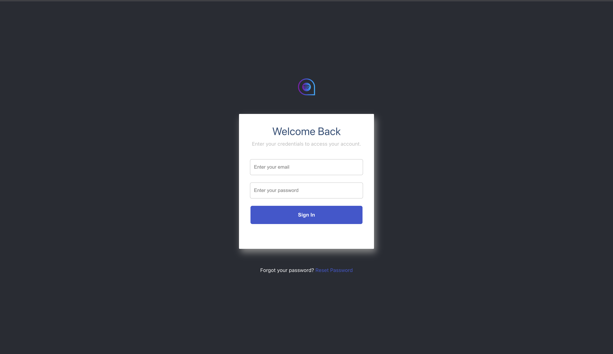

# Login

This is my solution to the test. It mocks a login process. It displays an alert on successful login.

  >

# The app is hosted on vercel

https://login-test-topaz.vercel.app/

# Test user

Email: test@test.com
Password: 123456

### `yarn`

This will install dependencies

### `yarn start`

Runs the app in the development mode.

### `yarn test`

Launches the test runner in the interactive watch mode.\
I used react testing library to write 2 simple test.
